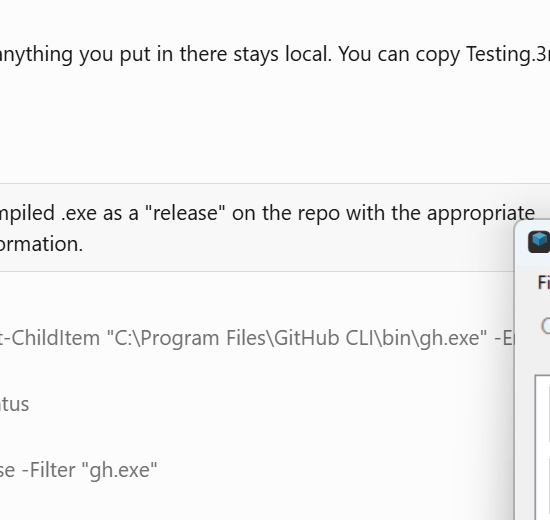

# 3MF Toolset

Edit extruder filament colors in `.3mf` (3D Manufacturing Format) files.



## Features

- Open and edit `filament_colour` values in `.3mf` project files
- Visual color swatches for each extruder
- Direct HEX color editing
- Windows Color Picker integration
- Drag-and-drop reordering of extruder colors
- Move Up/Down buttons for reordering
- Saves valid OPC-compliant `.3mf` files

## Usage

1. Open a `.3mf` file via **File > Open** or drag onto the executable
2. Click an extruder to select it
3. Edit the HEX value directly, or click **Pick Color...** for the color picker
4. Reorder extruders via drag-and-drop or the ▲/▼ buttons
5. **File > Save** or **File > Save As...** to write changes

## Build

Compiled with .NET Framework 4.x `csc.exe`:

```
csc /target:winexe /out:3MFToolset.exe /reference:System.Windows.Forms.dll /reference:System.Drawing.dll /reference:System.IO.Compression.dll /reference:System.IO.Compression.FileSystem.dll /reference:System.Core.dll Program.cs
```

## Requirements

- Windows (7 or later)
- .NET Framework 4.7.2+ (included with Windows 10/11)
