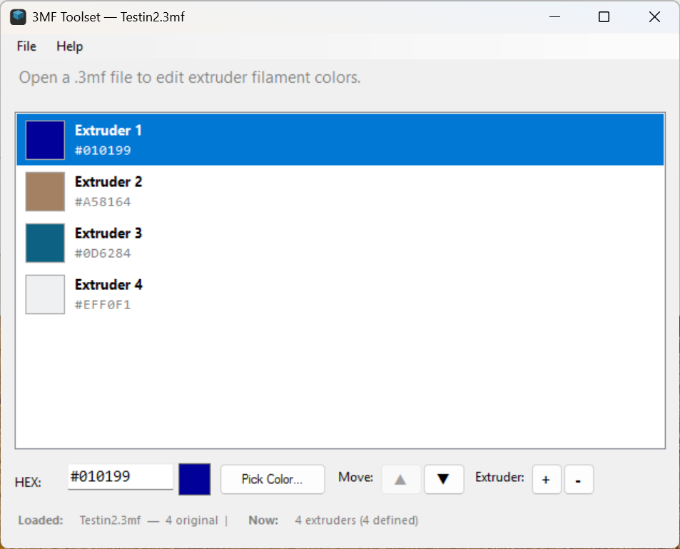

# 3MF Toolset

Edit extruder filament colors in `.3mf` (3D Manufacturing Format) files.



## Features

- Open and edit `filament_colour` values in `.3mf` project files
- Visual color swatches for each extruder with undefined-state indication
- Direct HEX color editing
- Windows Color Picker integration
- Add or remove extruders (1–16 range)
- Move Up/Down buttons for reordering
- Right-click context menu (Move Up, Move Down, Delete Extruder)
- Keyboard shortcuts: Ctrl+Up / Ctrl+Down to reorder
- Arrow keys to navigate between extruders
- Saves valid OPC-compliant `.3mf` files
- Status bar shows original and current extruder counts

## Usage

1. Open a `.3mf` file via **File > Open** (or drag onto the executable, or pass as command-line argument)
2. Click an extruder to select it
3. Edit the HEX value directly, or click **Pick Color...** for the color picker
4. Reorder extruders via the ▲/▼ buttons, **Ctrl+Up**/**Ctrl+Down**, or right-click **Move Up**/**Move Down**
5. Add extruders with **+** or remove with **−** (at least 1 required)
6. **File > Save** or **File > Save As...** to write changes
7. Undefined extruders are shown with a hatched swatch and "Not defined" label

## Build

Compiled with .NET Framework 4.x `csc.exe`:

```
csc /target:winexe /out:3MFToolset.exe /reference:System.Windows.Forms.dll /reference:System.Drawing.dll /reference:System.IO.Compression.dll /reference:System.IO.Compression.FileSystem.dll /reference:System.Core.dll Program.cs
```

## Requirements

- Windows (7 or later)
- .NET Framework 4.7.2+ (included with Windows 10/11)
